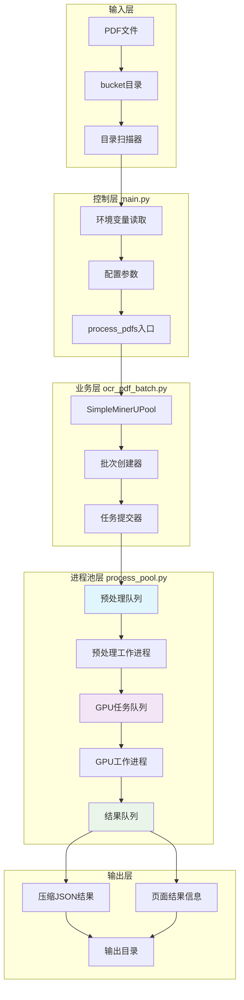
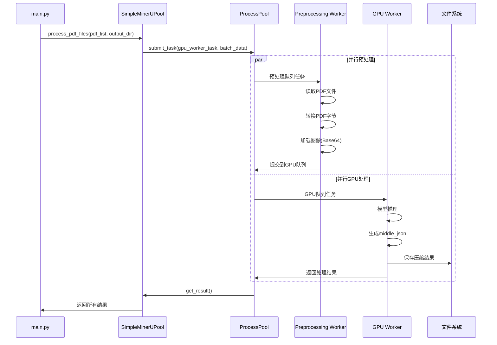
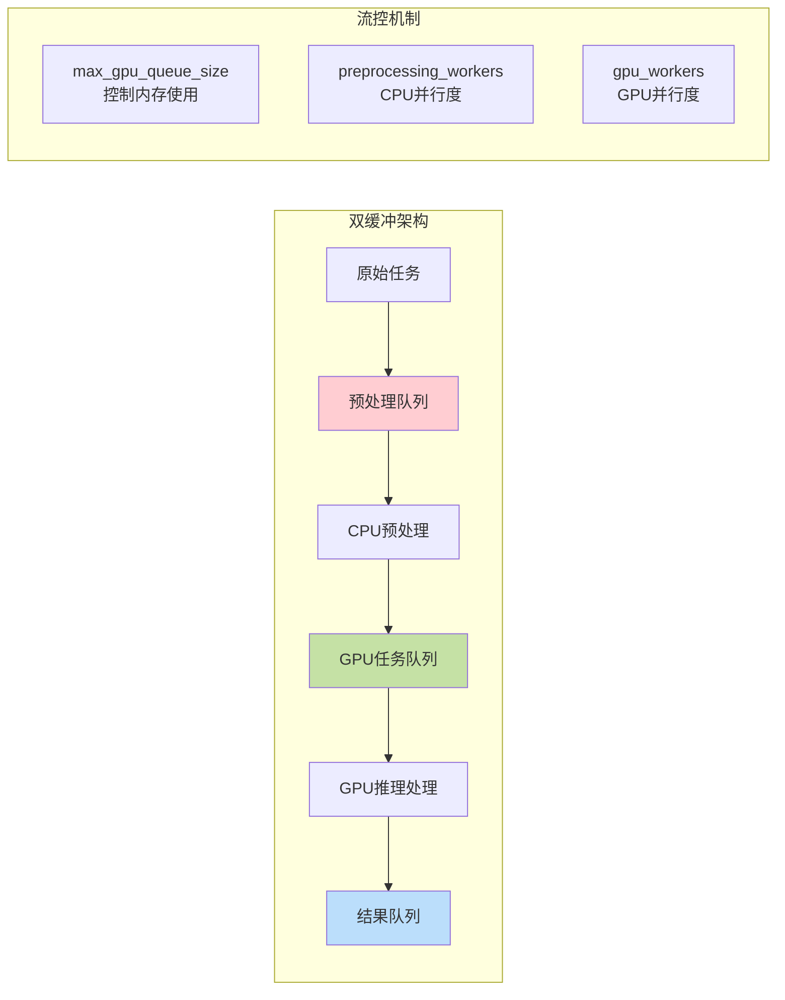
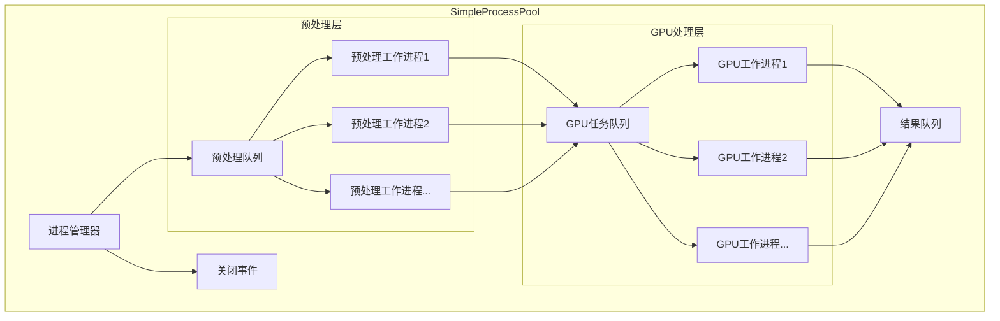
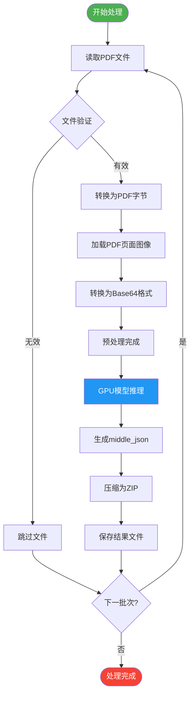
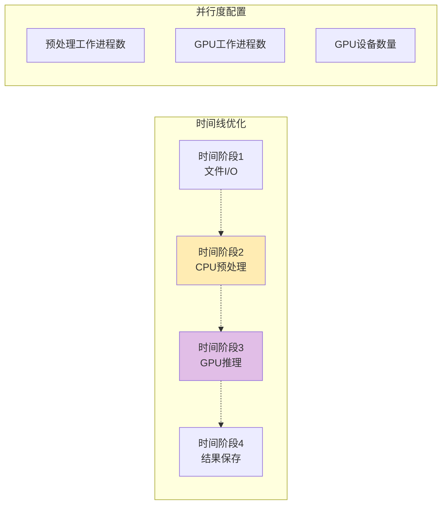
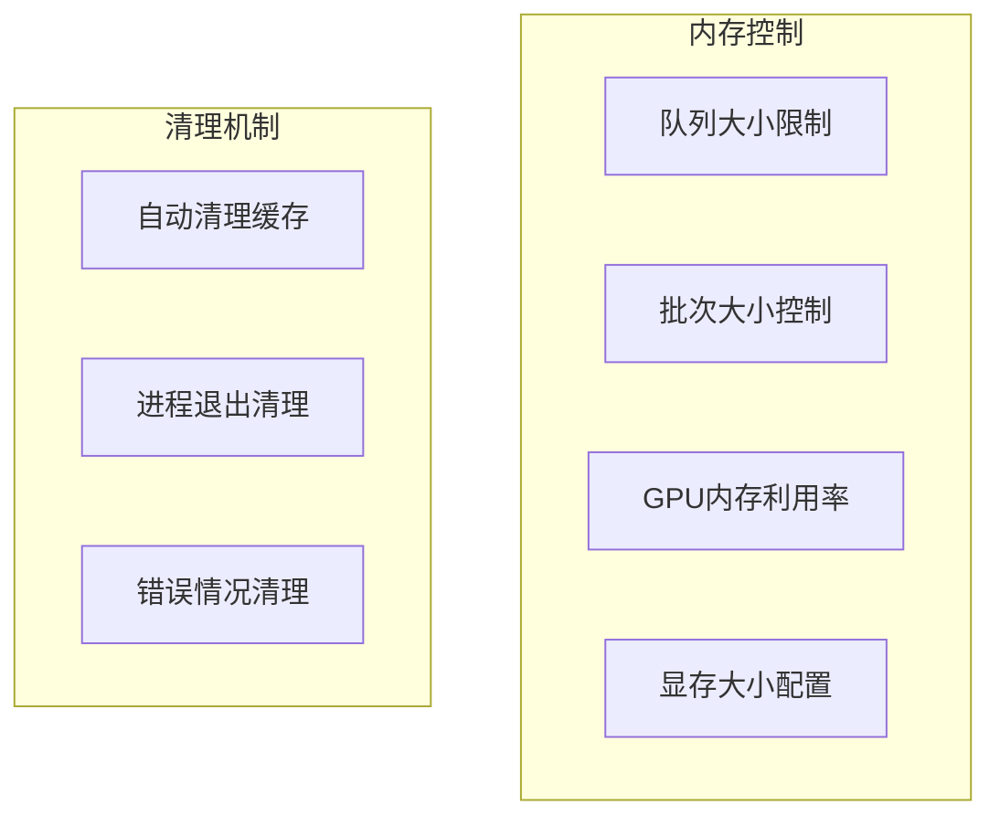
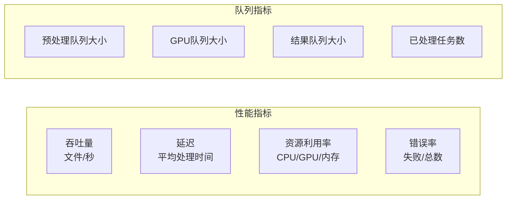

# MinerU PDF处理系统架构文档

## 系统概述

MinerU PDF处理系统是一个基于多进程和多GPU的高性能PDF文档分析和处理平台。系统采用双缓冲队列架构，实现了CPU预处理和GPU推理的并行处理，支持大规模PDF文档的批量处理。

## 整体架构图



## 数据流程图



## 核心组件架构

### 1. 双缓冲队列系统



### 2. 进程池内部结构



## 处理管道流程



## 文件结构映射

```mermaid
graph TD
    subgraph "源码结构"
        MainPy[main.py<br/>系统入口]
        BatchPy[ocr_pdf_batch.py<br/>批处理逻辑]
        PoolPy[process_pool.py<br/>进程池管理]
    end

    subgraph "目录结构"
        InputDir[/mnt/data/pdf/<br/>输入PDF目录]
        OutputDir[/mnt/data/output/<br/>输出结果目录]
        TempDir[/mnt/data/mineru_ocr_local_image_dir/<br/>临时图像目录]
    end

    MainPy --> BatchPy
    BatchPy --> PoolPy
    BatchPy --> InputDir
    BatchPy --> OutputDir
    BatchPy --> TempDir
```

## 性能优化策略

### 1. 并行处理优化



### 2. 内存管理策略



## 关键配置参数

| 参数名 | 类型 | 默认值 | 说明 |
|--------|------|--------|------|
| `GPU_IDS` | string | "0,1,2,3,4,5,6,7" | GPU设备ID列表 |
| `WORKERS_PER_GPU` | int | 2 | 每个GPU的工作进程数 |
| `VRAM_SIZE_GB` | int | 24 | GPU显存大小(GB) |
| `MAX_PAGES` | int | None | 单个PDF最大页数限制 |
| `BATCH_SIZE` | int | 384 | 批处理大小(页数) |
| `GPU_MEMORY_UTILIZATION` | float | 0.5 | GPU内存使用率 |
| `SHUFFLE` | boolean | false | 是否随机打乱文件顺序 |
| `PROPORTION` | float | 0 | 处理比例阈值 |

## 监控指标



## 扩展性设计

系统支持以下扩展能力：

1. **水平扩展**: 通过增加GPU设备数量扩展处理能力
2. **垂直扩展**: 调整每GPU工作进程数优化资源利用
3. **模块化**: 各组件独立，便于替换和升级
4. **配置驱动**: 通过环境变量灵活调整系统行为

这个架构设计实现了高效、可扩展、可维护的PDF处理系统，适用于大规模文档处理场景。