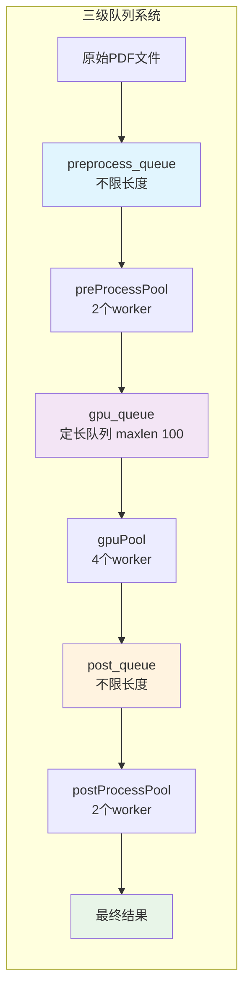
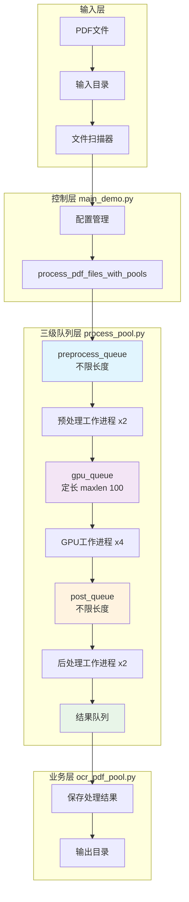
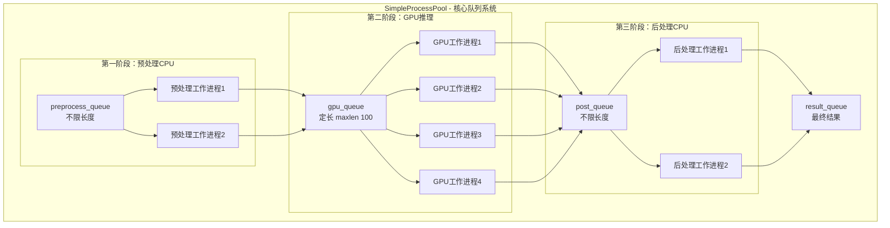
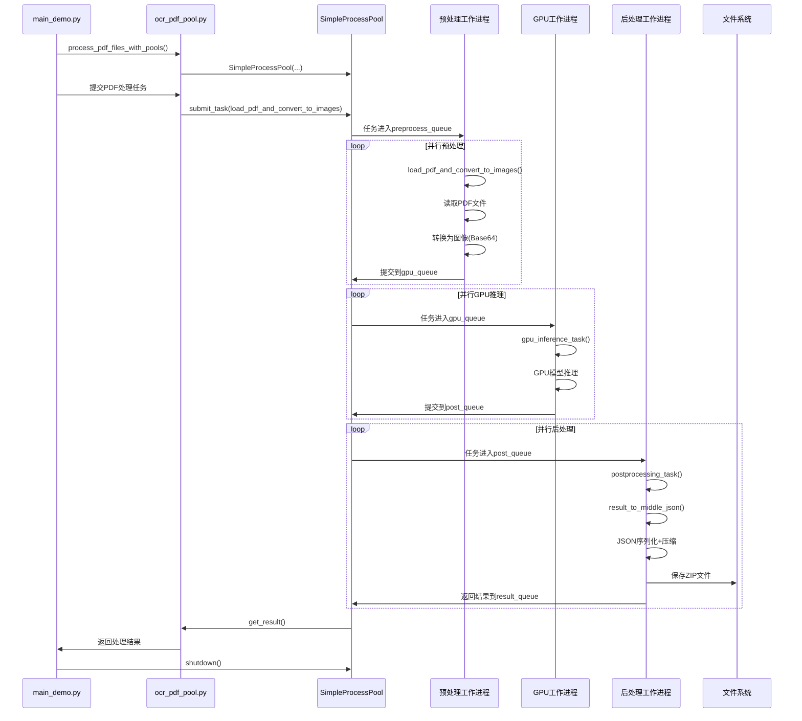

# Simple MinerU 架构文档

## 概述

Simple MinerU是基于pool.md设计的三级队列架构PDF处理系统。该架构将PDF处理流程分为三个明确的阶段：预处理CPU -> GPU推理 -> 后处理CPU，通过队列系统实现高效的流水线处理。

## 核心设计理念

根据pool.md的设计，系统采用三级队列架构：



## 系统架构图

### 整体架构流程



### 三级队列详细设计



## 数据流程图

### 详细处理流程



## 核心组件详解

### 1. SimpleProcessPool (process_pool.py)

**职责**: 三级队列系统的核心管理器

**关键特性**:
- **preprocess_queue**: 不限长度，接收原始PDF处理任务
- **gpu_queue**: 定长队列(maxlen 100)，控制内存使用
- **post_queue**: 不限长度，接收GPU推理结果进行后处理
- **流控机制**: 通过gpu_queue定长限制控制GPU内存使用

**配置参数**:
```python
preprocess_queue: mp.Queue()          # 不限长度
gpu_queue: mp.Queue(maxsize=100)     # 定长队列
post_queue: mp.Queue()               # 不限长度
preprocessing_workers = 2            # 预处理工作进程数
gpu_workers = 4                      # GPU工作进程数
postprocessing_workers = 2           # 后处理工作进程数
```

### 2. 工作进程类型

#### 预处理工作进程 (_preprocessing_worker)
- **功能**: CPU密集型任务（PDF读取、图像转换、Base64编码）
- **输入**: 原始PDF文件路径
- **输出**: 预处理数据结构（包含图像和元数据）
- **特点**: 等待gpu_queue有空位才提交结果

#### GPU工作进程 (_gpu_worker)
- **功能**: GPU推理任务（模型预测、文档分析）
- **输入**: 预处理后的图像数据
- **输出**: GPU推理结果（文本块、布局信息等）
- **特点**: 每个工作进程绑定特定GPU设备

#### 后处理工作进程 (_postprocessing_worker)
- **功能**: CPU密集型任务（JSON序列化、文件压缩、保存）
- **输入**: GPU推理结果
- **输出**: 最终压缩文件和统计信息
- **特点**: 负责I/O操作和结果持久化

### 3. OCR PDF Pool (ocr_pdf_pool.py)

**职责**: 连接PDF处理逻辑和三级队列系统的桥梁

**核心函数**:
- `load_pdf_and_convert_to_images()`: 预处理函数
- `gpu_inference_task()`: GPU推理函数
- `postprocessing_task()`: 后处理函数
- `process_pdf_files_with_pools()`: 主处理流程

## 配置和参数

### 系统级配置

| 参数名 | 默认值 | 说明 |
|--------|--------|------|
| `preprocessing_workers` | 2 | 预处理工作进程数 |
| `gpu_workers_per_gpu` | 1 | 每GPU工作进程数 |
| `postprocessing_workers` | 2 | 后处理工作进程数 |
| `max_gpu_queue_size` | 100 | GPU队列最大长度 |
| `enable_preprocessing` | True | 是否启用预处理队列 |

### 业务级配置

| 参数名 | 默认值 | 说明 |
|--------|--------|------|
| `GPU_IDS` | "0" | GPU设备ID列表 |
| `VRAM_SIZE_GB` | 24 | GPU显存大小 |
| `BATCH_SIZE` | 384 | 批处理大小(页数) |
| `MAX_PAGES` | None | 单个PDF最大页数 |
| `SHUFFLE` | False | 是否随机打乱文件 |

## 性能优化策略

### 1. 流水线并行

```mermaid
gantt
    title 三级队列流水线时间线
    dateFormat X
    axisFormat %s

    section 预处理CPU
    PDF1读取     :a1, 0, 2
    PDF1转换     :a2, after a1, 3
    PDF2读取     :a3, after a1, 2
    PDF2转换     :a4, after a3, 3

    section GPU推理
    PDF1推理     :b1, after a2, 4
    PDF2推理     :b2, after a4, 4

    section 后处理CPU
    PDF1保存     :c1, after b1, 1
    PDF2保存     :c2, after b2, 1
```



### 2. 内存管理

- **GPU队列限制**: maxlen=100控制GPU内存使用
- **进程隔离**: 每个工作进程独立内存空间
- **及时清理**: 任务完成后立即释放资源

### 3. 容错机制

- **错误传播**: 预处理/GPU/后处理错误都会传递到下一阶段
- **进程隔离**: 单个任务失败不影响其他任务
- **优雅关闭**: 支持超时和强制终止

## 文件结构

```
simple/
├── main_demo.py        # 系统入口，配置和参数管理
├── ocr_pdf_pool.py     # PDF处理逻辑，连接业务层和队列层
├── process_pool.py     # 三级队列进程池实现
└── arch.md            # 本架构文档
```

**文件职责**:
- `main_demo.py`: 系统启动、参数配置、错误处理
- `ocr_pdf_pool.py`: 业务逻辑定义（预处理、GPU推理、后处理函数）
- `process_pool.py`: 核心队列系统、工作进程管理

## 部署和运行

### 启动命令
```bash
cd simple/
python main_demo.py
```

### 环境要求
- Python 3.8+
- PyTorch (GPU支持)
- PyMuPDF (PDF处理)
- 多进程环境支持

## 扩展性设计

### 1. 水平扩展
- **GPU扩展**: 增加GPU设备数量，自动增加GPU工作进程
- **worker扩展**: 调整各阶段工作进程数适应不同负载

### 2. 垂直扩展
- **队列长度**: 调整gpu_queue大小平衡内存使用和吞吐量
- **批处理大小**: 调整BATCH_SIZE优化GPU利用率

### 3. 模块化
- **可插拔组件**: 各处理函数可独立替换
- **配置驱动**: 通过参数调整系统行为
- **监控接口**: 队列状态和性能指标可查询

## 监控指标

### 队列指标
- `preprocess_queue_size`: 预处理队列长度
- `gpu_queue_size`: GPU队列长度（应接近maxlen=100）
- `post_queue_size`: 后处理队列长度

### 性能指标
- **吞吐量**: 文件/秒
- **延迟**: 平均处理时间
- **资源利用率**: CPU/GPU/内存使用率
- **错误率**: 失败任务比例

这个简化架构设计实现了高效、可控、可扩展的PDF处理流水线，特别适合大规模文档处理场景。


## 参数

preprocess_queue：
    每个元素应该是这样的：
    - success: True/False;标记这个任务是正常还是失败
    - error_message: 如果是失败的，这里是异常message
    - filePath: pdf文件路径
preProcessQueue:
    会一次一次读取多个pdf文件直到page count达到要求，或者超时（比如1s）
    然后将多个pdf 打包为一个batch，作为一个任务发送到gpu_queue
gpu_queue:
   - success: True/False[];标记每个pdf是成功还是失败
   - error_message:[] 每个pdf处理，若错误是mesage，否则None
   - pdf_paths:[]
   - pdf_bytes_list:[]
   - all_images_list:[]
   - images_count_per_pdf:[]
gpuPool:
   接受一个任务，然后处理
post_queue:
   - 'gpu_results': gpu_results,
   - all_images_list
   - pdf_bytes_list
   - 其他参数